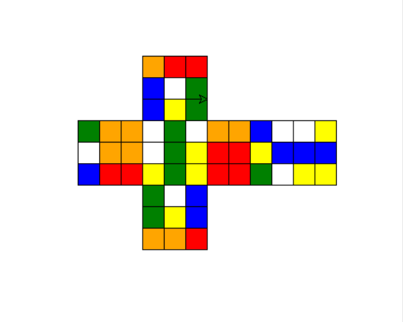

# Rubik's Cube Solver

## Overview
This is a Rubik's Cube solver that uses three different search algorithms to solve a 3x3 Rubik's Cube:

- **Breadth-First Search (BFS)**
- **Iterative Deepening Depth-First Search (IDFS)**
- **A* Search (A*) with Manhattan Distance Heuristic**

The solver takes an initial scrambled cube state and finds the optimal solution using one of the selected algorithms.

## Features
- Supports solving a 3x3 Rubik's Cube using multiple algorithms.
- Implements heuristic-based A* search for efficient solving.
- Provides step-by-step moves to reach the solved state.
- Graphical visualization using Turtle Library.



## Algorithms

### 1. Breadth-First Search (BFS)
- Explores all possible moves layer by layer.
- Guarantees the shortest solution but has high memory usage.

### 2. Iterative Deepening Depth-First Search (IDFS)
- A memory-efficient version of depth-first search.
- Iteratively increases the depth limit until a solution is found.

### 3. A* Search (A*) with Manhattan Distance Heuristic
- Uses a priority queue to explore the most promising paths first.
- Manhattan Distance heuristic estimates the number of moves needed to solve the cube.
- More efficient than BFS in terms of memory usage.

## Installation
1. Clone the repository:
   ```bash
   git clone https://github.com/yourusername/rubiks-cube-solver.git
   cd rubiks-cube-solver
   ```


## Usage
Modify the cube state by making changes to the test_scramble_cube method.
Run the solver with a specified algorithm:
```bash
python astar.py 
python bfs3.py 
python idfs.py 
```


## Requirements
- Python 3.x

## Future Improvements
- Implement additional heuristics for better A* performance.

## Conclusion
- A 3x3 Rubik's Cube has 43,252,003,274,489,856,000 permutations
- BFS and IDFS are not suitable for most 3x3 scrambled cubes. The time complexity is too high to justify their usage.
- There are 12 to exponent n possible states where n is the depth.
- If two different moves are made to a solved 3x3 cube, there can be 12^2 = 144 possible states. If 5 moves are made the number becomes 2985984!

## Contributing
Contributions are welcome! Feel free to open an issue or submit a pull request.


